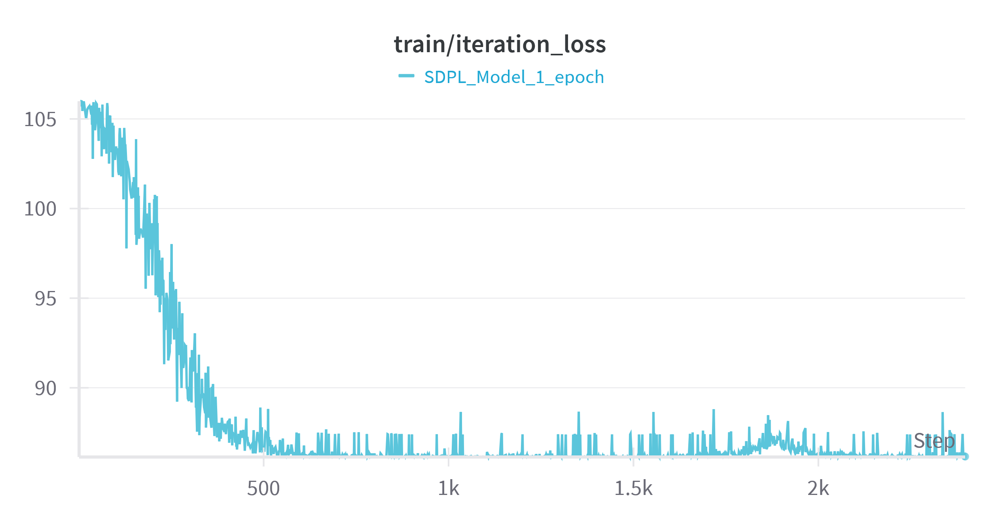
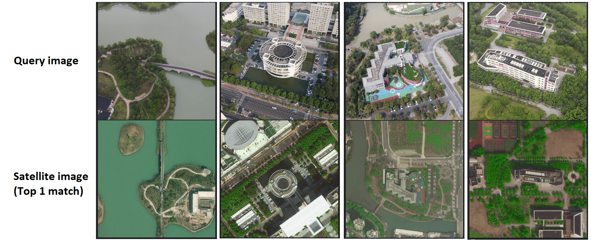

## SDPL: Shifting-Dense Partition Learning for UAV-View Geo-Localization

This repo contains PyTorch implementation of ["SDPL: Shifting-Dense Partition Learning for UAV-View Geo-Localization"](https://arxiv.org/abs/2403.04172) by Quan Chen, Tingyu Wang, Zihao Yang, Haoran Li, Rongfeng Lu, Yaoqi Sun, Bolun Zheng, Chenggang Yan (Published March 2024)

For training, see `notebooks`.

Model implementation in `src/model.py`

Presentation made for major course in ITMO Unvicersity can be found in `docs`

# Training

# Result

